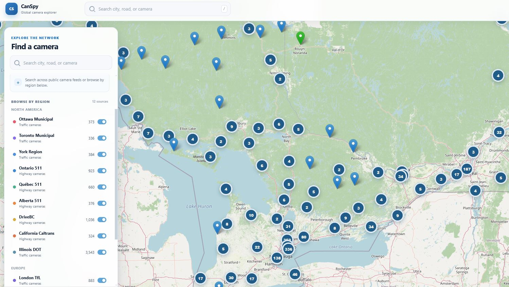
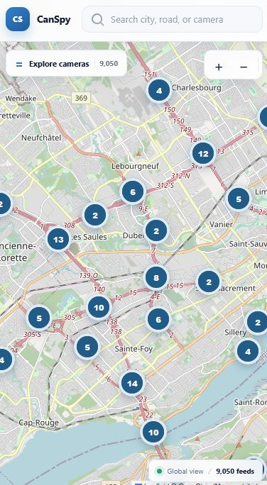

# CanSpy

> Watch the world move — 10,000+ live cameras (mostly traffic, some wildlife, all public) on one map

[](https://global-cam.vercel.app/)

<div style="display:flex; gap:12px; align-items:flex-start; flex-wrap:wrap;">
  
  
</div>

## What is this?

Started as a way to watch Ottawa traffic. Now it's a global map of public traffic cameras from cities across Canada, the US, the UK, and Australia — plus a handful of wildlife/nature cams for good measure. Click any pin and watch the feed.

## Features

- 🌍 **Global interactive map** — Leaflet + OpenStreetMap tiles
- 📍 **10,000+ camera pins** across 12+ regions
- 🎥 **Live feeds** — image, video (MP4), and YouTube streams
- 🔵 **Auto-refresh** — every 15s when a popup is open
- 🗂️ **Layer toggles** — show/hide regions on the fly
- ✅ **Marker clustering** — so you can actually see the map

## Regions

| Region | Feed type |
|--------|-----------|
| Ottawa, ON | Image |
| Ontario MTO (511) | Image |
| Toronto, ON | Image |
| York Region, ON | Image |
| Quebec (511) | Video (MP4) |
| Alberta (511) | Image |
| British Columbia (DriveBC) | Image |
| London, UK (TfL) | Video (MP4) |
| Finland (Fintraffic Digitraffic) | Image |
| California (Caltrans) | Image |
| Sydney, NSW | Image |
| Chicago / Illinois | Image |
| Wildlife cams (worldwide) | YouTube |

## Tech Stack

**React 19** · **Vite 8** · **Leaflet** · **leaflet.markercluster** · **Vercel**

## Getting Started

```bash
npm install
npm run dev     # local dev at localhost:5173
npm run build   # production build to dist/
npm run lint    # eslint
npm run preview # preview production build
```

## How It Works

Camera data is pre-fetched into static JSON files — no live API calls at runtime. When you click a marker, the popup pulls the latest frame from the public camera feed. Some regions need an image proxy (`wsrv.nl`) to bypass hotlink protection. All feeds in an open popup refresh every 15 seconds.

## Data Sources

City of Ottawa, Ontario 511, City of Toronto Open Data, Quebec 511, Alberta 511, DriveBC, Transport for London (TfL JamCams), Fintraffic Digitraffic, Caltrans, Transport for NSW, Chicago DOT, York Region, and various YouTube live streams.

## Scripts

| Command | What it does |
|---------|-------------|
| `npm run dev` | Start dev server |
| `npm run build` | Production build |
| `npm run lint` | Run ESLint |
| `npm run preview` | Preview production build |
